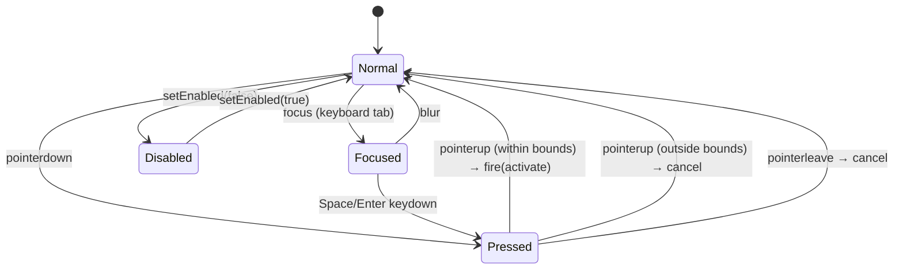

# Control rendering architecture

**Purpose:** the canonical Aaron UI reference for how Phase 3 controls (buttons, checkboxes, popups, tabs, fields, sliders, progress bars, scrollbars) render via the existing Phase 4 runtime. Pairs with:

- [`docs/runtime-rendering-architecture.md`](./runtime-rendering-architecture.md) — window-level rendering (the WM↔runtime seam)
- [`docs/kaleidoscope-geometry-spec.md`](./kaleidoscope-geometry-spec.md) — the input contract (cicn + cinf + ppat semantics)

**Status:** [Phase 3.0](https://github.com/khawkins98/aaron-ui/issues/69). Spec only; no code. Phase 3.1 (`applyControlChrome` shared infrastructure) and per-control tickets (#3.2–#3.8) implement against this spec.

**Scope:** in-window control elements only. Window chrome itself is the runtime architecture doc's concern.

---

## 1. Why this document exists

The Phase 4 runtime ships the primitives (`applyChromeElement` for cinf 9-slice + ppat overlay; `themeRegistry` for the active theme; `loadTheme` for the data plumbing). Phase 3 wires those primitives to actual interactive controls.

Without this spec, every per-control ticket would re-derive the same decisions:

- How does a button's `data-state="pressed"` flip the cicn URL?
- Where does the focus ring come from when Mac OS 8 had no hover state?
- How does keyboard activation work without breaking native `<input>` accessibility?
- How does the declarative scanner promote `<input type="checkbox">` into a styled checkbox without losing form-submit semantics?

Answering each once here means seven per-control tickets implement consistently rather than each inventing their own answer.

---

## 2. The control rendering model — DOM contract

Every Phase 3 control follows the same DOM shape:

```html
<div class="aaron-control aaron-{control-type}"
     data-state="normal|pressed|disabled"
     role="..."
     aria-*="..."
     tabindex="0|-1">
  <!-- per-control internal structure if needed -->
  <!-- chrome cicns render via inline-style background-image flipped by data-state -->
</div>
```

Or, when promoted from a native form element (preferred for accessibility):

```html
<!-- Promoted form: the native input/select stays, wrapped or styled -->
<input type="checkbox" data-aaron-checkbox> 
<!-- Becomes: -->
<label class="aaron-control aaron-checkbox" data-state="normal">
  <input type="checkbox" hidden> <!-- preserved for forms + a11y -->
  <span class="aaron-checkbox__chrome" aria-hidden="true"></span>
  <span class="aaron-checkbox__label"></span>
</label>
```

### State attributes

All controls expose the same three state attributes for the cinf-driven CSS to key off:

| Attribute | Values | Meaning |
|---|---|---|
| `data-state` | `normal` / `pressed` / `disabled` / `focused` | Interaction state |
| `aria-checked` | `true` / `false` / `mixed` | For checkboxes, radios |
| `aria-disabled` | `true` / absent | Mirrors `data-state="disabled"` for SR |

State combinations (e.g., a focused-and-pressed button) cascade through CSS selectors: `[data-state="pressed"]` takes precedence over `[data-state="focused"]` which takes precedence over `[data-state="normal"]`. Disabled overrides everything.

### Per-control internal structure

Most controls are single-element (the chrome cicn paints onto the outer `.aaron-control`). Some compose multiple cicn regions:

- **Popup menu:** text-section + arrow-box composite — two child divs, each with their own cicn
- **Scrollbar:** track + thumb + arrow-up + arrow-down — four+ child divs
- **Slider:** track + thumb + (optional) tick marks
- **Progress bar:** frame + track + fill — three layered divs

Composite structure is per-control; the spec for each composite lives in §9 (per-control specs) below.

---

## 3. State machine — the universal pattern

The interaction state machine is identical across all interactive controls:



`applyControlChrome` (Phase 3.1) implements this state machine once and wires each control's per-state cicn map to it. Per-control tickets just supply the map.

### What "fire(activate)" means per control

| Control | `activate` event |
|---|---|
| Push button | dispatch `click` event |
| Default button | dispatch `click` event (same as push; the default-button styling is purely visual) |
| Checkbox | toggle `checked`, dispatch `change` |
| Radio | set `checked` to true within group, dispatch `change` |
| Popup menu | open the native `<select>` dropdown |
| Slider | begin drag mode (continuous, not stateful) |
| Tab | switch active tab; dispatch `change` on the parent `<role="tablist">` |
| Progress bar | non-interactive; no activate |
| Scrollbar arrow | dispatch scroll event |

---

## 4. Mapping from chromeElements to state visuals

The canonical bundles' `chromeElements` catalog already has per-state cicn entries with predictable naming:

```
mass:werk 7 Le chromeElements (relevant subset):
  normal-off-normal      ← checkbox medium off normal
  normal-off-pressed     ← checkbox medium off pressed
  normal-off-disabled    ← checkbox medium off disabled
  normal-on-normal       ← checkbox medium on normal
  normal-on-pressed      ← checkbox medium on pressed
  normal-on-disabled     ← checkbox medium on disabled
  large-off-normal       ← checkbox large off normal
  large-off-pressed
  ... (full 3 sizes × 2 selections × 3 states matrix)
  
  normal-vertical-scrollbar    ← scrollbar track normal
  pressed-vertical-scrollbar
  empty-vertical-scrollbar     ← no content to scroll
  disabled-vertical-scrollbar
  
  vertical-thumb               ← scrollbar thumb normal
  pressed-vertical-thumb
  
  progress-bar-active          ← barber-pole fill
  progress-bar-track-active
  progress-bar-frame-active
```

The pattern: `{size?}-{selection?}-{state}-{control}`. Naming isn't 100% consistent across schemes (LEARNINGS 2026-05-16 "Same-author vocabulary isn't normalized") — `applyControlChrome` accepts an explicit map from control state to chromeElements slug so each per-control ticket can declare its own mapping. The mapping for the canonical bundles is documented per-control in §9.

---

## 5. The `applyControlChrome` contract (Phase 3.1)

```ts
interface ApplyControlChromeOptions {
  /**
   * Maps interaction state → chromeElements slug from the loaded theme.
   * Each ticket supplies the map for its control.
   */
  stateChromeMap: {
    normal:   string;
    pressed?: string;   // falls back to `normal` if omitted (read-only controls)
    disabled?: string;  // falls back to `normal` if omitted
    focused?: string;   // falls back to `normal` if omitted
  };

  /**
   * Optional extension for stateful controls (checkbox, radio).
   * When provided, the state map keys flip when `aria-checked` flips.
   */
  checkedStateChromeMap?: {
    normal:   string;
    pressed?: string;
    disabled?: string;
  };

  /**
   * Whether this control captures pointer events. Default true.
   * Set false for read-only controls (progress bar) so pointer
   * events pass through to elements behind.
   */
  interactive?: boolean;

  /**
   * Whether to set up the state machine pointer/keyboard handlers.
   * Default true.
   */
  wireStateMachine?: boolean;

  /**
   * Override the activate event. Default: `dispatchEvent(new Event('click'))`.
   */
  onActivate?: (el: HTMLElement) => void;
}

function applyControlChrome(
  el: HTMLElement,
  opts: ApplyControlChromeOptions,
): () => void; // returns teardown
```

The helper:

1. Looks up the current theme via `themeRegistry.current()`
2. Resolves `stateChromeMap[currentState]` against `theme.chromeElements`
3. Applies the cicn via `applyChromeElement` (cinf 9-slice + ppat overlay)
4. Sets up pointer/keyboard listeners per the state machine in §3
5. Re-applies on `aaron:themechange` (so swap-theme re-styles)
6. Returns teardown that detaches listeners + clears chrome

---

## 6. Declarative scanner extension

The Phase 1 scanner promotes `[data-aaron-window]` elements into `AaronWindow` instances. Phase 3 extends the scanner with one attribute per control:

| Attribute | Promotes | Becomes |
|---|---|---|
| `[data-aaron-button]` | `<button>` or `<div>` | Push button |
| `[data-aaron-button-default]` | `<button>` | Default button (variant) |
| `[data-aaron-checkbox]` | `<input type="checkbox">` | Checkbox |
| `[data-aaron-radio]` | `<input type="radio">` | Radio button |
| `[data-aaron-field]` | `<input>` / `<textarea>` | Text field |
| `[data-aaron-popup]` | `<select>` | Popup menu |
| `[data-aaron-tabs]` | `<div>` | Tab container (children with `[role="tab"]`) |
| `[data-aaron-group-box]` | `<fieldset>` or `<div>` | Group box / frame |
| `[data-aaron-slider]` | `<input type="range">` | Slider |
| `[data-aaron-progress]` | `<progress>` | Progress bar |
| `[data-aaron-scrollbar]` | (auto-applied per CSS) | Scrollbar styling |

**Preferred pattern:** wrap or augment native form elements, don't replace. `<input type="checkbox" data-aaron-checkbox>` keeps the native form-submit semantics, the keyboard handling, and the screen-reader behaviour. The visible chrome is rendered alongside the native element, with `display: none` on the native one when the visual chrome is what the user sees.

---

## 7. Resolved open questions

### Hover state policy

**Decision: no hover affordance by default; focus ring on keyboard focus only.**

Mac OS 8 chrome had three control states — Normal, Pressed, Disabled — and no Hover. Adding a hover state would either require synthesizing a fourth state's artwork (which we can't do faithfully) or just visually flickering between Normal and Pressed (which is wrong).

But accessibility requires *some* visible focus indication for keyboard users. The compromise:

- **No `:hover` rule in any Phase 3 control's CSS by default**
- **Visible focus ring on `:focus-visible`** — only shown for keyboard focus, never for mouse focus (so mouse users see authentic period-correct chrome)
- Focus ring uses a CSS `outline` (not the cicn chrome) — a 2px solid outline in the scheme's accent color, with `outline-offset: 1px`
- **Opt-in hover affordance** via a CSS custom property: `--aaron-allow-hover-affordance: 1` enables a subtle cursor change + 1px outline on `:hover` for consumers who want it

This matches the LEARNINGS 2026-05-16 entry on hover and earned its keep in the WM core's titlebar — extending the same policy to controls keeps the project coherent.

### Slider directional variants

**Decision: ship non-directional MVP first (#3.7); directional variants land as polish if needed.**

The chromeElements catalogs contain four slider artwork variants per scheme:
- Non-directional vertical (the standard "thumb pointing nowhere" slider)
- Non-directional horizontal
- Down-pointing (vertical slider with arrowhead at bottom)
- Right-pointing (horizontal slider with arrowhead at right)

The pointed variants are used when the slider's thumb should visually indicate the direction of motion (e.g., a "drag from full to empty" slider). They're rare in modern UIs and add visual complexity for limited use.

MVP scope (#3.7) ships non-directional only. Pointed variants are a follow-up sub-ticket if a consumer specifically asks for them. The CSS hooks (`--aaron-slider-direction: 'down' | 'right' | 'none'`) get reserved now so the opt-in is a CSS change, not an API change.

### Scrollbar style default

**Decision: split arrows at each end (Mac OS 8 classic style); unified track is an opt-in flag.**

The `Colr` resource has a flag `unifiedScrollbarTrack` that picks between two period-correct styles:

- **Split arrows** (Colr default = false): up arrow at top, down arrow at bottom, track in the middle. Classic Mac OS 8.
- **Unified track** (Colr = true): track with arrows at one end (Mac OS 8.5+ optional style; later default in OS X).

Aaron UI's default matches the Mac OS 8 default (split). Schemes that set `unifiedScrollbarTrack: true` in their `meta.json` get the unified style automatically. Consumers can override per-scrollbar via `data-aaron-scrollbar-style="split|unified"`.

---

## 8. Focus management

### Tab order

`tabindex` defaults per control type:

| Control | Default `tabindex` |
|---|---|
| Button / Default button | `0` (focusable) |
| Checkbox / Radio | inherited from native `<input>` (`0` by default) |
| Text field | inherited from native `<input>` |
| Popup menu | inherited from native `<select>` |
| Tabs | first tab `0`, others `-1` (arrow-key navigation within the group) |
| Slider | inherited from native `<input type="range">` |
| Progress bar | not focusable (read-only) |
| Scrollbar | not focusable (operated via scrolling, not Tab) |

### Focus trap interaction

`AaronWindow` modals have focus trap from Phase 1. Phase 3 controls inside a modal are automatically included in the trap because they're real focusable DOM elements. No additional wiring needed.

### Focus ring

A single CSS rule (added once via the engine baseline stylesheet) applies the focus ring:

```css
.aaron-control:focus-visible {
  outline: 2px solid var(--aaron-colr-accent, #316ac5);
  outline-offset: 1px;
  /* Optional inset shadow as a fallback for high-contrast modes */
  box-shadow: 0 0 0 1px Canvas inset;
}
```

`:focus-visible` ensures mouse clicks don't show the ring (preserving authentic chrome appearance for mouse interaction).

---

## 9. Per-control DOM specs

Brief specs for each control's DOM contract. Detailed implementation lives in each per-control ticket; this section is the contract those tickets satisfy.

### Push button (#3.2) — CSS-drawn (no cicn artwork)

```html
<button class="aaron-control aaron-button" data-aaron-button data-state="normal">
  Click me
</button>
```

**Rendering path:** CSS-drawn via engine-baseline stylesheet (`src/controls/engineBaseline.ts`), tinted with `--aaron-colr-*` palette custom properties. **No chromeElements mapping** — wired with `wireControlStateMachine` rather than `applyControlChrome`.

**Why CSS, not cicn:** inspection of both canonical bundles (mass:werk 7 Le, Dark ErgoBox 2) found **no push-button chromeElements entries**. In real Mac OS Appearance, push buttons were drawn by the system CDEF (Control DEFinition), not by Kaleidoscope schemes — schemes themed the surroundings (titlebars, scrollbars, frames), and buttons inherited the system rendering. Aaron UI matches that division by drawing buttons in CSS, tinted by the scheme's palette.

**State flips** via `data-state` attribute selectors in CSS. `aria-disabled="true"` adds a separate disabled style.

**Behavior:** standard button. Space + Enter activate (via `wireControlStateMachine`). Disabled blocks events. No `:hover` (period-faithful, per §8).

### Default button (#3.2)

```html
<button class="aaron-control aaron-button aaron-button--default" data-aaron-button-default data-state="normal">
  OK
</button>
```

**Visual difference from push button:** 2px black outline added via `box-shadow: 0 0 0 2px var(--aaron-colr-default-button-outline)`. Same CSS-drawn path as the regular push button; the variant just adds the outer outline.

**Rendering precedent:** push buttons + default buttons + group boxes (and likely tab strips for some schemes) go CSS-drawn. Checkbox, radio, popup, slider, scrollbar arrows go cicn-rendered (chromeElements present in canonical bundles). Each per-control ticket confirms the path by inspecting the canonical bundles first.

### Checkbox (#3.3)

```html
<label class="aaron-control aaron-checkbox" data-state="normal">
  <input type="checkbox" data-aaron-checkbox hidden> 
  <span class="aaron-checkbox__chrome" aria-hidden="true"></span>
  <span class="aaron-checkbox__label">I agree</span>
</label>
```

**State map:** `normal-off-normal`, `normal-off-pressed`, `normal-off-disabled` (unchecked); `normal-on-*` (checked). Size variants (`small-*`, `large-*`) selected via `data-aaron-checkbox-size`.

### Radio button (#3.3)

Same shape as checkbox but with `<input type="radio">`. Within a `<fieldset>` or shared `name` attribute, clicking one radio unchecks the others.

### Text field (#3.4)

```html
<div class="aaron-control aaron-field" data-state="normal">
  <input type="text" data-aaron-field>
  <!-- chrome cicn renders as the inset frame around the input via inline border-image -->
</div>
```

**State map:** `normal-field`, `focused-field`, `disabled-field`. Pressed state typically same as focused (text fields don't have a distinct "pressed" visual).

### Popup menu (#3.5)

```html
<div class="aaron-control aaron-popup" data-state="normal">
  <select data-aaron-popup>
    <option>One</option>
    <option>Two</option>
  </select>
  <span class="aaron-popup__text-section" aria-hidden="true">One</span>
  <span class="aaron-popup__arrow-section" aria-hidden="true"></span>
</div>
```

**Two-cicn composite:** `popup-button-text-{normal,pressed,disabled}` for the text-section (left half); `popup-button-arrow-{normal,pressed,disabled}` for the arrow-box (right half).

**Behavior:** clicking opens the native `<select>` dropdown. The cicn chrome stays "pressed" while the dropdown is open (detect via `focus` + close on `change`/`blur`).

### Tabs (#3.6)

```html
<div class="aaron-control aaron-tabs" role="tablist" data-aaron-tabs>
  <button role="tab" aria-selected="true" tabindex="0" data-state="normal">Tab 1</button>
  <button role="tab" aria-selected="false" tabindex="-1" data-state="normal">Tab 2</button>
  ...
</div>
<div role="tabpanel" id="panel-1" aria-labelledby="tab-1"> ... </div>
```

**State map per tab:** `ssf-front-tab` (active) / `ssf-rear-tab` (inactive) / `ssf-disabled-front-tab` / `ssf-pressed-rear-tab`. `lsf-*` variants for large tabs (`data-aaron-tabs-size="large"`).

**Keyboard:** Arrow Left/Right switches selected tab.

### Group box (#3.6)

```html
<fieldset class="aaron-control aaron-group-box" data-aaron-group-box>
  <legend>Settings</legend>
  <!-- child controls -->
</fieldset>
```

**Chrome:** engraved-rectangle frame (Mac OS 8 group box). Cinf 9-slice via a single `group-box-frame` chromeElement entry (if scheme provides) or CSS placeholder.

### Slider (#3.7)

```html
<div class="aaron-control aaron-slider" data-state="normal" data-aaron-slider-orientation="horizontal">
  <input type="range" data-aaron-slider min="0" max="100" value="50" hidden>
  <div class="aaron-slider__track" aria-hidden="true">
    <div class="aaron-slider__thumb" aria-hidden="true"></div>
  </div>
  <!-- optional tick marks -->
</div>
```

**Track chromeElements:** `horizontal-slider-track-normal`, `horizontal-slider-track-pressed`, `horizontal-slider-track-disabled`. Same vertical.  
**Thumb chromeElements:** `horizontal-slider-thumb` (non-directional). Native `<input>` drives value; chrome reflects.

### Progress bar (#3.7)

```html
<div class="aaron-control aaron-progress" data-state="normal" data-aaron-progress-mode="determinate">
  <progress value="40" max="100" data-aaron-progress hidden></progress>
  <div class="aaron-progress__track" aria-hidden="true">
    <div class="aaron-progress__fill" aria-hidden="true" style="width: 40%"></div>
  </div>
  <!-- frame end-caps -->
</div>
```

**chromeElements:** `progress-bar-track-active`, `progress-bar-active` (fill — barber-pole pattern), `progress-bar-frame-active`. Inactive variants for indeterminate state.

### Scrollbar (#3.8)

The most complex composite. See [issue #77](https://github.com/khawkins98/aaron-ui/issues/77) for the full DOM spec — too detailed to inline here. Highlights:

- Track + thumb + arrow-up + arrow-down per orientation
- Thumb uses cinf 9-slice (the grip pattern must stay crisp at any thumb width — LEARNINGS 2026-05-16 "never guess border-image-slice values, decode the cicn first")
- Split-arrow style by default; unified track via `unifiedScrollbarTrack` flag from Colr

---

## 10. What this document does NOT cover

- **Window chrome rendering.** That's [`docs/runtime-rendering-architecture.md`](./runtime-rendering-architecture.md).
- **The wnd# side-recipe composer** for windowType chrome. That's `composeWindowChrome.ts` (#64.1).
- **Specific per-control implementation details** — those live in the per-control tickets (#3.2–#3.8) and their PRs.
- **Animation / transitions** between control states (e.g., a popup menu's open animation). Phase 6 polish.
- **Internationalization / RTL.** Phase 6.
- **Mobile / touch refinement** beyond what Pointer Events gives for free. Phase 6.

---

## 11. Decisions log

Non-obvious calls, with reasons, for future reviewers:

| Decision | Reason |
|---|---|
| No `:hover` rule in default CSS | Period-faithful per LEARNINGS 2026-05-16. Visible focus on `:focus-visible` instead. |
| Focus ring via CSS `outline`, not cicn-derived | Schemes don't ship "focused" cicn variants. Outline is universal CSS, predictable across schemes. |
| Wrap native form elements, don't replace | Accessibility + form-submit semantics. Native `<input>` stays in the DOM; chrome paints alongside. |
| State map per control (not hardcoded) | Slug naming isn't normalized across schemes (LEARNINGS 2026-05-16). Each per-control ticket supplies its scheme-vocabulary mapping. |
| Single `applyControlChrome` helper for all interactive controls | The state machine is identical across every interactive control (per §3). Implement once. |
| Split-arrow scrollbar default | Matches Mac OS 8 default. Colr's `unifiedScrollbarTrack` flag overrides per-scheme. |
| Non-directional sliders only in MVP | Directional variants are rare; opt-in via CSS later. |
| `applyControlChrome` returns teardown | Same pattern as Phase 4 helpers. Consumers can attach/detach cleanly. |
| Light DOM, not Shadow DOM | Consistent with PRD §North Star + runtime architecture's same decision. Consumer page-level CSS still applies inside controls. |

---

## 12. References

- [`docs/runtime-rendering-architecture.md`](./runtime-rendering-architecture.md) — window-level pair
- [`docs/kaleidoscope-geometry-spec.md`](./kaleidoscope-geometry-spec.md) — cinf 9-slice + chromeElements catalog
- [`docs/theme-bundle-layout.md`](./theme-bundle-layout.md) — bundle structure
- PRD §Phased delivery — Phase 3
- LEARNINGS 2026-05-16 entry on hover state (period-faithful no-hover)
- LEARNINGS 2026-05-16 entry on cicn-name vocabulary not being normalized
- LEARNINGS 2026-05-16 entry on never guessing `border-image-slice` values
- Issue [#22 — Phase 3 epic](https://github.com/khawkins98/aaron-ui/issues/22)
- Issue [#69 — this ticket](https://github.com/khawkins98/aaron-ui/issues/69)
