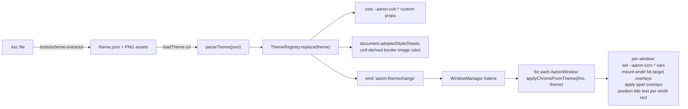
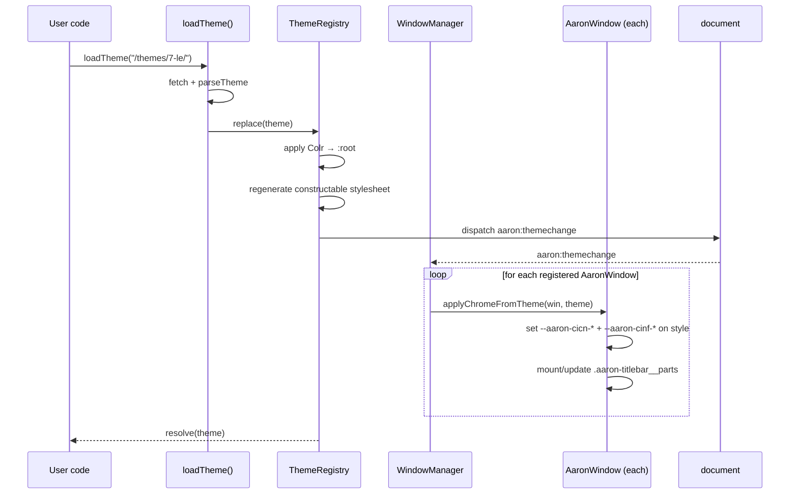
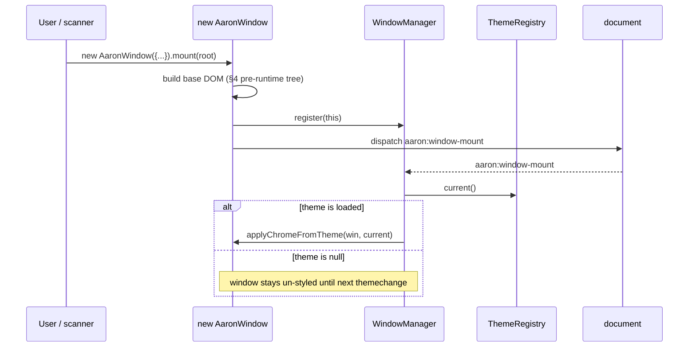
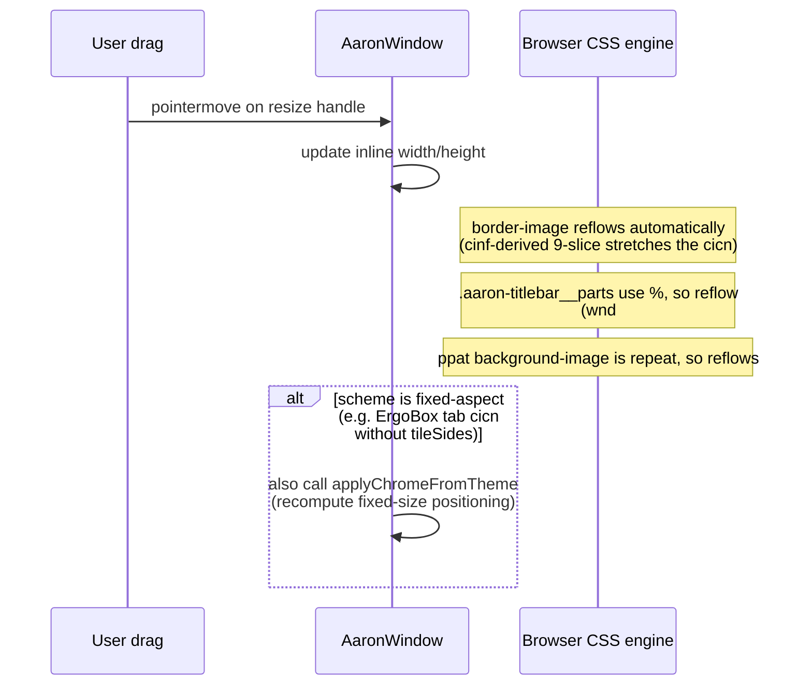
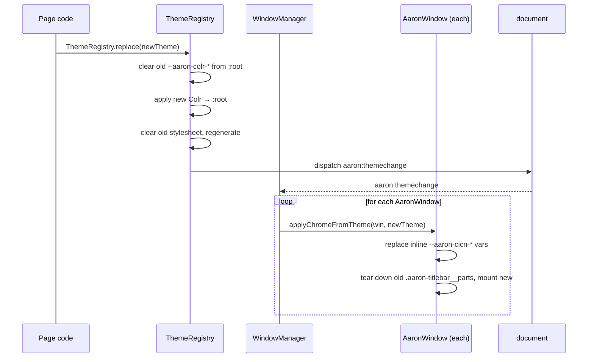
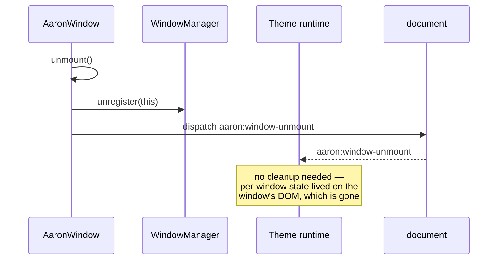

# Runtime rendering architecture

**Purpose:** the canonical Aaron UI reference for *how* a parsed `Theme` object becomes living DOM at runtime. This is the **output contract** that pairs with [`docs/kaleidoscope-geometry-spec.md`](./kaleidoscope-geometry-spec.md) (the **input contract**). Together the two documents define everything Phase 4's runtime tickets need to agree on before code lands.

**Status:** Phase 4.0 deliverable. Must merge before [#38](https://github.com/khawkins98/aaron-ui/issues/38) (`loadTheme()` core) starts. Tickets [#38–#44](https://github.com/khawkins98/aaron-ui/issues/23) reference this document for their DOM model, CSS strategy, and lifecycle contract.

**Source authority:** Phase 1's shipped `AaronWindow` (the WM core's actual DOM output), [`demo/themes-raster.html`](../demo/themes-raster.html) (the hand-coded prototype this generalizes), and the geometry spec (which says *what* we render — this says *how*).

---

## 1. Why this document exists

Aaron UI is **non-conventional web window management.** Conventional libraries (WinBox, jsPanel, every framework window component) render chrome from CSS authored by the library: a `border` here, a `background-color` there, a `linear-gradient()` title bar. Aaron UI does not. Aaron UI's chrome is whatever raster + metadata a loaded `.ksc` Kaleidoscope scheme defines — composited at runtime via the rules in [`docs/kaleidoscope-geometry-spec.md`](./kaleidoscope-geometry-spec.md).

That changes everything about the rendering model:

- **Chrome is bitmap, not vector / CSS-drawn.** Every window border, every button bevel, every scrollbar groove is a PNG slice from a `cicn` resource, composited per scheme-supplied `cinf` 9-slice geometry.
- **Chrome composition has runtime layering.** A `ppat` overlay can sit over a `cicn` body region (per `cinf.bgPatternId`). The library can't just set a `background-image` and walk away.
- **Hit targets are scheme-supplied.** The pixel rectangle where the close box lives inside the chrome cicn is defined by `wnd#` data, not by `top: 6px; left: 8px;` constants.
- **No hover state, ever.** Period Mac OS chrome had Normal / Pressed / Disabled — that's the entire state space. The CSS has *no* `:hover` rule by default; that's a positive design choice, not an omission.
- **Fixed-aspect bitmap meets variable-aspect window.** Some scheme chrome stretches via 9-slice (`cinf.tileSides`); some doesn't (e.g. ErgoBox's tab-projecting titlebar). The runtime has to know which is which and switch strategies.

Without an explicit output-contract document, the Phase 4 runtime tickets ([#40](https://github.com/khawkins98/aaron-ui/issues/40)/[#41](https://github.com/khawkins98/aaron-ui/issues/41)/[#42](https://github.com/khawkins98/aaron-ui/issues/42)) would each re-derive these decisions in PR review and inevitably contradict each other. This document fixes the contract.

---

## 2. The non-conventional bit, summarized

A "normal" web window library:

```
new MyWindow({ title: "Hi" })
  └─ <div class="my-window">
       <div class="my-titlebar">Hi</div>     /* CSS: background: gradient; border-bottom: 1px solid; */
       <div class="my-body">...</div>
     </div>
```

An Aaron UI window with a Kaleidoscope theme loaded:

```
new AaronWindow({ title: "Hi" })
  └─ <div class="aaron-window">
       <div class="aaron-titlebar">                  /* background-image: url(cicn-titlebar-active.png);
                                                       border-image: url(cicn-titlebar-active.png) 8 8 8 8 stretch;
                                                       (+ ppat overlay if cinf.bgPatternId) */
         <div class="aaron-titlebar__title">Hi</div> /* position from wnd# part "title" rect */
         <div class="aaron-titlebar__parts">         /* invisible hit-target overlays from wnd# */
           <div data-part="closeBox">…</div>
           <div data-part="zoomBox">…</div>
           <div data-part="collapseBox">…</div>
         </div>
       </div>
       <div class="aaron-content">…</div>            /* background-image: ppat tile (from theme.json),
                                                       border-image from window-frame cicn */
       <div class="aaron-window__resize" data-handle="se">…</div>  /* maybe painted with growbox cicn */
       …seven more resize handles…
     </div>
```

Same outer DOM. Drastically different rendering model. **The DOM is the contract between the WM and the runtime; the cicn / ppat / cinf / wnd# resources flow through CSS custom properties + attribute toggles + a constructable stylesheet.**

---

## 3. Pipeline overview



Three actors, one direction of flow:

1. **`loadTheme(url)`** — fetches `theme.json`, validates via Phase 4.1 schema, returns a `Theme`.
2. **`ThemeRegistry`** — module-level singleton (matches the `WindowManager` pattern from Phase 1). Holds the current theme. On `replace()`: applies palette to `:root`, regenerates the cinf stylesheet, emits a `themechange` event.
3. **`WindowManager`** (extended) — listens for `themechange` and walks its registry of `AaronWindow` instances, calling each one's `applyChromeFromTheme()`.

**Key separation:** the WM core does *not* import the theme runtime. The runtime listens to events and reads attributes the WM exposes. The WM remains usable with no theme loaded (un-styled fallback). See §8 (WM ↔ runtime seam).

---

## 4. DOM model of a chromed Aaron window

The DOM Phase 1 produces today (`AaronWindow.mount()` at `src/window-manager/AaronWindow.ts:416`):

```
<div class="aaron-window"
     data-aaron-window
     data-aaron-promoted
     data-state="active"           ← runtime selector hook
     role="dialog"
     aria-modal="true"
     aria-labelledby="aaron-window-title-N"
     tabindex="-1">
  <div class="aaron-titlebar">
    <div class="aaron-titlebar__title">
      <span id="aaron-window-title-N">Window title text</span>
    </div>
    <!-- ↓ Phase 4 runtime inserts here ↓ -->
  </div>
  <div class="aaron-content">
    <!-- user-supplied HTML -->
  </div>
  <div class="aaron-window__resize" data-handle="n"></div>
  <div class="aaron-window__resize" data-handle="ne"></div>
  <div class="aaron-window__resize" data-handle="e"></div>
  <div class="aaron-window__resize" data-handle="se"></div>
  <div class="aaron-window__resize" data-handle="s"></div>
  <div class="aaron-window__resize" data-handle="sw"></div>
  <div class="aaron-window__resize" data-handle="w"></div>
  <div class="aaron-window__resize" data-handle="nw"></div>
</div>
```

The Phase 4 runtime makes **two structural additions** and **n attribute / CSS-variable additions**:

```
<div class="aaron-window"
     data-aaron-window
     data-aaron-promoted
     data-state="active"
     data-aaron-themed="masswerk-7-le"            ← NEW: which theme is applied
     style="--aaron-cicn-frame: url(...active.png);
            --aaron-cicn-frame-inactive: url(...inactive.png);
            --aaron-window-frame-cinf-corner: 8;
            --aaron-window-frame-cinf-side: 8;"     ← NEW: per-window cicn URLs + cinf geometry
     role="dialog" ... >
  <div class="aaron-titlebar"
       style="--aaron-cicn-titlebar: url(...);
              --aaron-cinf-corner: 4;">              ← NEW: per-region cicn + cinf
    <div class="aaron-titlebar__title">
      <span id="aaron-window-title-N">Window title text</span>
    </div>
    <div class="aaron-titlebar__parts"               ← NEW: hit-target container
         aria-hidden="true">                          (aria-hidden because actions still
                                                       fire via aria-labelled real buttons
                                                       in a Phase 5 refactor)
      <div class="aaron-titlebar__part"
           data-part="closeBox"
           data-state="normal"                       ← runtime toggles to "pressed" / "disabled"
           style="left: 6.06%;  top: 18.75%;         ← from wnd# part rect, expressed as %
                  width: 8.33%; height: 50%;"></div>
      <div class="aaron-titlebar__part"
           data-part="zoomBox" ...></div>
      <div class="aaron-titlebar__part"
           data-part="collapseBox" ...></div>
    </div>
  </div>
  <div class="aaron-content"
       style="--aaron-ppat-bg: url(...);
              --aaron-cicn-frame-content: url(...);">  ← NEW: body ppat + frame cicn
    <!-- user-supplied HTML, unchanged -->
  </div>
  <!-- resize handles unchanged from Phase 1 -->
  <div class="aaron-window__resize" data-handle="se"
       style="--aaron-cicn-growbox: url(...);">       ← NEW: SE handle gets growbox cicn
       </div>
  ...
</div>
```

**What changed, structurally:**

1. **`.aaron-titlebar__parts`** — new child of `.aaron-titlebar`, holds invisible (or near-invisible) absolutely-positioned hit-target divs for each `wnd#` part. Mounted by `applyChromeFromTheme()` on first theme application; updated when the theme swaps; removed when a theme is unloaded.

**What changed, attribute / CSS-variable-wise:**

2. **`data-aaron-themed="<theme-slug>"`** — selector hook for theme-specific CSS overrides (rare; reserved for cases where a scheme's idiosyncrasy genuinely can't be encoded in cinf/wnd#).
3. **Per-element inline `style` carrying CSS custom properties** — cicn URLs, cinf geometry numbers, ppat URLs. Inline because each window can theoretically use different cicns (e.g. document-window vs. modal-dialog wnd# entries within one scheme). The companion stylesheet (next section) consumes these vars.
4. **`data-state` on `.aaron-titlebar__part`** — `"normal" | "pressed" | "disabled"`. The state machine for chrome controls. **No `"hover"`.** See §6 (state machine).

---

## 5. CSS strategy

### 5.1 Three layers of CSS

Aaron UI's CSS comes from three sources, layered in this precedence (lowest → highest):

| Layer | Origin | Lifetime | Contains |
|---|---|---|---|
| **Engine baseline** | shipped in `aaron-ui.css` | static | layout primitives, resize-handle hit areas, focus-trap visuals, the no-op state when no theme loaded |
| **Theme generated** | constructable stylesheet built by `loadTheme()` | rebuilt per theme | cinf-derived `border-image` rules, ppat compositing, control state selectors with cicn URLs |
| **Per-window inline** | inline `style` attribute on each window's DOM | per-window | cicn URL + cinf geometry for that specific window's parts |

The theme-generated layer is the interesting one. Two viable implementations:

- **Option A: Constructable Stylesheets.** `new CSSStyleSheet()` populated programmatically, appended to `document.adoptedStyleSheets`. Replace the array on theme swap. **Pro:** standard, fast, garbage-collects cleanly. **Con:** older Safari needs a polyfill (acceptable — Aaron UI is modern-evergreen only per PRD §Non-goals).
- **Option B: `<style id="aaron-theme">` in `<head>`.** Programmatically set `textContent` on theme load; replace on swap. **Pro:** universally supported, no polyfill. **Con:** lives in the cascade like any author stylesheet, easier to accidentally override.

**Decision: Option A** — Constructable Stylesheets. Adoption is the right primitive; "modern evergreen only" is already a PRD constraint; Option B's "lives in the cascade" property is a footgun, not a feature.

### 5.2 CSS custom properties — the palette

The `Colr` palette becomes `:root`-scoped CSS custom properties. Naming convention: `--aaron-colr-<key>` where `<key>` matches the Colr field name in lowercase-kebab. E.g.:

```css
:root {
  --aaron-colr-active-titlebar-bg: #cccccc;
  --aaron-colr-active-titlebar-fg: #000000;
  --aaron-colr-inactive-titlebar-bg: #eeeeee;
  --aaron-colr-inactive-titlebar-fg: #888888;
  --aaron-colr-window-frame: #888888;
  /* …per Colr resource… */
}
```

The catalog is per-scheme — `parseTheme()` returns the full Colr key set in `theme.palette`, and `loadTheme()` iterates and sets each one. The engine-baseline CSS uses these custom props by name, so engine CSS doesn't need to know what's in any specific scheme; it just references `var(--aaron-colr-active-titlebar-fg, currentColor)`.

### 5.3 CSS custom properties — the asset URLs

Per-window, set as inline `style`. Naming convention: `--aaron-cicn-<region>` and `--aaron-ppat-<region>`.

```html
<div class="aaron-window"
     style="--aaron-cicn-frame: url('/themes/7-le/cicns/window-active.png');
            --aaron-cicn-frame-inactive: url('/themes/7-le/cicns/window-inactive.png');
            --aaron-cinf-corner: 8;
            --aaron-cinf-side: 8;">
```

CSS in the theme-generated layer then references them:

```css
.aaron-window {
  border-image: var(--aaron-cicn-frame) var(--aaron-cinf-corner) stretch;
}
.aaron-window[data-state="inactive"] {
  border-image-source: var(--aaron-cicn-frame-inactive);
}
```

This is the indirection that lets `data-state` toggles flip artwork without JavaScript touching any DOM property other than the attribute itself.

### 5.4 Light DOM, not Shadow DOM

**Decision: light DOM.** No Shadow DOM anywhere in Aaron UI.

**Why:** Aaron UI is framework-agnostic and consumers must be able to style window content with their own page-level CSS. Shadow DOM creates style-scoping headaches: a Tailwind page consuming Aaron UI wouldn't have its utility classes apply inside windows; a Bootstrap consumer would see their resets fail. The cost — that `body { … }` selectors can technically reach inside Aaron UI windows — is acceptable because everything Aaron UI styles is class-prefixed (`.aaron-*`) and the consumer is in their own house.

### 5.5 Real divs, not pseudo-elements, for chrome regions

**Decision: real `<div>` children for `wnd#` hit-target overlays; pseudo-elements only for purely decorative purposes (cinf-driven decoration that doesn't need event capture).**

**Why:** `wnd#` parts are interactive. They have to dispatch `click` to `AaronWindow.close()` / `.maximize()` / etc. Pseudo-elements can't capture events independently — `::before` and `::after` are part of their host element's hit-test region; a click on the close-box pseudo-element is just a click on the title bar, with no way to distinguish. Real `<div>` children let the runtime attach pointer-event listeners per part. Consistency means use real divs everywhere chrome regions are addressable, even purely decorative ones.

### 5.6 No `:hover` rule in default CSS

**Decision: the engine baseline + theme-generated CSS contains zero `:hover` rules.** A scheme's `cicn` artwork has Normal / Pressed / Disabled variants; there is no Hover variant. Adding `:hover` artificially would either (a) require synthesizing a fourth state's artwork (which we can't, and shouldn't), or (b) just visually flicker between Normal and Pressed, which is wrong.

**Escape hatch (future):** a `--aaron-hover-affordance` custom property could enable a 1px outline or cursor change for accessibility, opt-in only, never default. Tracked in LEARNINGS 2026-05-16 entry on hover.

---

## 6. Composition layers within `.aaron-window`

Z-order from back to front within a chromed window:

```
┌──────────────────────────────────────────────┐  z=0  .aaron-window background
│  cicn frame (full window-frame composite,    │       (border-image from --aaron-cicn-frame)
│   stretched via cinf 9-slice, OR             │
│   tiled per cinf.tileSides)                  │
│                                              │
│   ┌────────────────────────────────────┐    │  z=1  .aaron-titlebar
│   │ cicn titlebar (background-image)   │    │       (background-image from --aaron-cicn-titlebar)
│   │  + ppat overlay (if cinf.bgPattern)│    │  z=2  ppat overlay
│   │                                    │    │       (CSS multi-layer background)
│   │  title text (positioned by wnd#)   │    │  z=3  .aaron-titlebar__title
│   │  ┌──┐ ┌──┐    titletext     ┌──┐  │    │  z=4  .aaron-titlebar__parts
│   │  │×│ │↕│                    │↕│  │    │       (invisible hit-target overlays)
│   │  └──┘ └──┘                  └──┘  │    │
│   └────────────────────────────────────┘    │
│                                              │
│   ┌────────────────────────────────────┐    │  z=1  .aaron-content
│   │  ppat body tile (background-image, │    │       (background-image: ppat tile)
│   │   repeated)                        │    │
│   │                                    │    │
│   │  user content (DOM)                │    │  z=2  user content
│   │                                    │    │
│   └────────────────────────────────────┘    │
│                                              │
│                                       [grow] │  z=2  .aaron-window__resize[data-handle="se"]
└──────────────────────────────────────────────┘       (background-image: cicn growbox)
```

**Two-source compositing of the title bar:** the cicn provides the chrome paint; the ppat (if `cinf.bgPatternId !== 0`) overlays a pattern. Implementation: multi-layer CSS `background-image`:

```css
.aaron-titlebar {
  background-image:
    var(--aaron-ppat-titlebar, none),  /* top — drawn first in source order, last in stack */
    var(--aaron-cicn-titlebar);        /* bottom */
  background-size: auto, auto;
  background-repeat: repeat, no-repeat;
}
```

**No `mix-blend-mode`.** The demo's current `mix-blend-mode: multiply` is a workaround that disappears once `cinf.bgPatternId` is honored — the ppat sits over the cicn as a separate layer, not composited.

---

## 7. Control state machine

Three states. Three only.

```mermaid
stateDiagram-v2
    [*] --> Normal
    Normal --> Pressed: pointerdown
    Pressed --> Normal: pointerup<br/>(within bounds → click fires)
    Pressed --> Normal: pointerup<br/>(outside bounds → click cancelled)
    Normal --> Disabled: setEnabled(false)
    Disabled --> Normal: setEnabled(true)
    Pressed --> Disabled: setEnabled(false)<br/>(rare; pressed cancelled)
```



CSS surfacing:

```css
/* Default — Normal state — comes from the cicn URL in --aaron-cicn-closebox */
.aaron-titlebar__part[data-part="closeBox"] {
  background-image: var(--aaron-cicn-closebox-normal);
}

/* Pressed — the cicn URL swaps via the indirection */
.aaron-titlebar__part[data-part="closeBox"][data-state="pressed"] {
  background-image: var(--aaron-cicn-closebox-pressed);
}

/* Disabled */
.aaron-titlebar__part[data-part="closeBox"][aria-disabled="true"] {
  background-image: var(--aaron-cicn-closebox-disabled);
  cursor: not-allowed;
}

/* NO :hover rule — period-faithful. */
```

The runtime toggles `data-state="pressed"` on `pointerdown` and removes it on `pointerup` (within bounds → fire click; outside → cancel). `aria-disabled` follows the WM's `setEnabled()` API.

**Inactive window chrome** is a separate axis: `data-state="active|inactive"` on `.aaron-window` itself toggles the *whole* chrome to its inactive variant via cascading custom-property reassignment.

---

## 8. WM ↔ runtime seam

**Contract:** the WM core does not import the theme runtime. The theme runtime listens to events and reads attributes the WM exposes. The WM remains fully functional with no theme loaded (engine-baseline CSS only — un-styled fallback).

### 8.1 What the WM provides

- **DOM structure** — the tree in §4 (pre-runtime variant) is the runtime's input.
- **Lifecycle events** dispatched on `document` and on each `.aaron-window`:
  - `aaron:window-mount` (detail: `{ window: AaronWindow }`)
  - `aaron:window-unmount`
  - `aaron:window-resize` (detail: `{ width, height }`)
  - `aaron:window-state-change` (detail: `{ from, to }` — active ↔ inactive, normal ↔ collapsed)
- **A small slot-selector contract** — the runtime is permitted to query/insert/remove children inside specific selectors:
  - `.aaron-titlebar` — runtime may append `.aaron-titlebar__parts`
  - `.aaron-content` — runtime may set background custom properties
  - `.aaron-window__resize[data-handle="se"]` — runtime may set growbox custom property
  
  Everywhere else in the WM's DOM is **not the runtime's to touch.**

### 8.2 What the runtime provides

- **`ThemeRegistry`** — singleton with `replace(theme: Theme | null)`, `current(): Theme | null`, `subscribe(listener)`. Emits `aaron:themechange` on `document` on every `replace()`.
- **`applyChromeFromTheme(win: AaronWindow, theme: Theme)`** — pure function; takes a window and a theme, writes CSS custom properties + mounts/updates `.aaron-titlebar__parts`. Idempotent.
- **No back-reference to WM internals.** The runtime knows about the DOM contract only.

### 8.3 Loading order

```
1. <script type="module" src="aaron-ui.js"> evaluates
   - WindowManager singleton created
   - ThemeRegistry singleton created
   - Scanner starts on DOMContentLoaded
   - Default theme (bundled 7 Le) loaded asynchronously
2. Scanner promotes [data-aaron-window] elements → AaronWindow instances
   - On window mount, AaronWindow emits aaron:window-mount
3. Runtime listens for aaron:window-mount
   - If a theme is already current: applyChromeFromTheme(newWindow, current)
   - If not: subscribe and wait for first themechange
4. Default theme finishes loading
   - ThemeRegistry.replace(7Le) emits aaron:themechange
   - Runtime iterates all known windows, calls applyChromeFromTheme on each
```

The asynchronous default-theme load means there's a brief window after `DOMContentLoaded` where windows render with engine-baseline CSS only (un-styled). Acceptable; mitigation is to inline-embed 7 Le's `theme.json` text in the bundle so the network round-trip is just for PNGs (which can stream).

---

## 9. Lifecycle sequences

### 9.1 First-time theme load



### 9.2 Window mount after theme is loaded



### 9.3 Resize

Resize is **deliberately almost zero-work** for the runtime. CSS does the heavy lifting:



**The exception** is fixed-aspect chrome — when `cinf.tileSides` indicates no stretch is allowed, the runtime has to actively re-compute the chrome on each resize (likely throttled with `requestAnimationFrame`). This is the price of supporting non-rectangular schemes like ErgoBox.

### 9.4 Theme swap



The MutationObserver on `<html data-aaron-theme>` (Phase 4.9) is just a thin wrapper that calls `loadTheme()` + `ThemeRegistry.replace()` on attribute change.

### 9.5 Window unmount



Per-window theme state lives **only** on the window's DOM (inline `style`, `.aaron-titlebar__parts` children). When the window unmounts, that state is garbage-collected with the DOM. The runtime keeps no per-window registry of its own.

---

## 10. Impedance mismatches and how we resolve them

| Mismatch | Web idiom expects | Kaleidoscope provides | Resolution |
|---|---|---|---|
| Variable-size window vs. fixed-size cicn bitmap | Authored-vector chrome that reflows for free (Bootstrap, Material) | Single bitmap chrome composite at a specific pixel size | `cinf` 9-slice via CSS `border-image`. When `cinf.tileSides == NoStretch`, fall back to fixed-aspect rendering at integer scale (per LEARNINGS "Bitmap chrome is inherently fixed-aspect"). |
| Hit targets at fixed pixel offsets | `position: absolute; top: 6px; left: 6px;` constants in the library's CSS | `wnd#` part rects expressed in chrome-cicn coordinates | Runtime reads `wnd#`, converts each part rect to `%` relative to titlebar size, sets inline `style` on `.aaron-titlebar__part` divs. Reflows for free under standard resize. |
| Hover state | Every interactive element has a `:hover` variant in modern web design | No hover state in Mac OS 8 chrome (3 states only) | **Zero `:hover` rules in default CSS.** Documented in README and architecture. Opt-in via `--aaron-hover-affordance` left as a future escape hatch. |
| Active vs. inactive chrome | Usually a CSS-only `:focus-within` rule | Cicn has separate Active and Inactive artwork variants | `data-state="active|inactive"` on `.aaron-window`. Runtime sets both `--aaron-cicn-frame` and `--aaron-cicn-frame-inactive` per-window; CSS swaps via attribute-selector indirection. |
| Title bar pattern background | `linear-gradient()` or `repeating-linear-gradient()` | `cicn` + optional `ppat` overlay (per `cinf.bgPatternId`) | Multi-layer CSS `background-image`: ppat tile on top, cicn beneath. No `mix-blend-mode`. |
| Window-frame border | `border: 1px solid` | A frame `cicn` with cinf-defined slice positions | `border-image` from `--aaron-cicn-frame` with cinf-derived slice values. Engine-baseline CSS provides `border: 1px solid currentColor` as fallback for un-themed mode. |
| Tab-projecting chrome (ErgoBox) | None — modern toolkits avoid non-rectangular windows | Cicn pixel geometry encodes the tab shape directly | Fixed-aspect rendering when scheme indicates. Runtime recomputes on resize (rAF-throttled). Tradeoff: ErgoBox windows have fewer resize degrees of freedom under bitmap chrome. Documented per-scheme in `PROVENANCE.md`. |
| Growbox in the SE corner | Browser-rendered resize handle, or CSS gradient | `cicn` for the growbox glyph | Runtime sets `--aaron-cicn-growbox` on `.aaron-window__resize[data-handle="se"]`. Engine-baseline CSS hides this when the var is unset, so un-themed mode falls back to invisible handle. |
| Pseudo-3D control bevels (push button, etc.) | Author with `box-shadow inset` + colors | Per-control `cicn` with state variants | Per-control CSS sets `background-image: var(--aaron-cicn-button-${state})` keyed off `data-state` attribute. No `box-shadow` involvement. |

---

## 11. What this document does NOT cover

- **What's in a `.ksc` file** — see [`docs/kaleidoscope-geometry-spec.md`](./kaleidoscope-geometry-spec.md).
- **The `theme.json` schema** — see [`docs/kaleidoscope-geometry-spec.md`](./kaleidoscope-geometry-spec.md) §7 + [#35](https://github.com/khawkins98/aaron-ui/issues/35) (TypeScript codification).
- **The extractor's CLI / how to port a scheme** — see [`tools/scheme-extractor/README.md`](../tools/scheme-extractor/README.md) and (forthcoming, per [#44](https://github.com/khawkins98/aaron-ui/issues/44)) `docs/porting-a-kaleidoscope-scheme.md`.
- **WM core behavior** (drag, resize, focus, z-order, ARIA, keyboard) — see [`src/window-manager/`](../src/window-manager/) and Phase 1 acceptance tests.
- **Per-scheme provenance / license posture** — see each scheme bundle's `PROVENANCE.md`.
- **Theme authoring (creating new `.ksc` schemes)** — per CONTRIBUTING.md §"Adding a theme (porting a Kaleidoscope scheme)", that flow uses ResEdit + the Kaleidoscope SDK under emulation. Out of scope for this runtime doc.

---

## 12. Decisions log

Non-obvious calls, with reasons, so future readers don't re-litigate them:

| Decision | Reason |
|---|---|
| Constructable Stylesheets (not `<style>` tag) for theme-generated CSS | Right primitive for the job; modern-evergreen is a PRD constraint anyway; "lives in the cascade" of a `<style>` tag is a footgun |
| Light DOM (not Shadow DOM) | Consumers must be able to style window content with page-level CSS (Tailwind, Bootstrap, etc.). Shadow DOM breaks that. |
| Real `<div>` children (not pseudo-elements) for `wnd#` hit targets | Pseudo-elements can't capture events independently. Consistency: divs everywhere. |
| No `:hover` rule in default CSS | Period-faithful (Mac OS 8 had 3 states, no hover). Opt-in via custom prop reserved for future. |
| Per-window inline `style` for cicn URLs (not `:root`-scoped) | Different windows can theoretically use different `wnd#` entries within one scheme (document window vs. modal dialog). Per-window scope is correct. |
| Per-region custom properties named `--aaron-cicn-<region>` and `--aaron-ppat-<region>` (not `--aaron-bg-<region>`) | The cicn/ppat distinction is load-bearing — they're composited differently. Naming preserves the distinction so future readers know which layer they're touching. |
| `wnd#` part rects converted to `%` (not `px`) | Lets CSS resize for free under standard 9-slice chrome. Fixed-aspect schemes recompute on resize anyway, so per-axis units don't matter for them. |
| Theme runtime listens to events; WM does not import runtime | Decoupling; WM stays usable un-themed; runtime can be tree-shaken if a consumer wants pure WM |
| Bundled default theme loads asynchronously, not synchronously | Synchronous would block first paint. Asynchronous + engine-baseline fallback means windows render immediately, then re-paint when 7 Le finishes loading. Brief un-styled flash is the price; mitigated by inlining `theme.json` text and only fetching PNGs. |
| Fixed-aspect schemes recompute on `pointermove`-driven resize via `requestAnimationFrame` throttle | Without throttle, every pointer event triggers a layout recompute and the resize becomes janky. rAF is the correct throttle for visual-update work. |
| The `mix-blend-mode: multiply` hack from the current demo is removed | It produces the right visual via the wrong mechanism. Honoring `cinf.bgPatternId` as a real overlay layer is the right model. |
| No animation by default | Animation belongs in Phase 6. Phase 4 ships static rendering with correct geometry. |

---

## 13. Open questions for the runtime tickets

Items intentionally left for the implementing tickets to resolve, recorded here so they don't get forgotten:

- **(#40)** Should cinf-derived `border-image` rules be one rule per cicn, or one rule per `[data-aaron-cicn-id="N"]` selector with a single rule template? Trade-off: stylesheet size vs. number of CSS rules. Implementation should benchmark both at 100 windows × 20 cicns scale.
- **(#41)** When `cinf.bgPatternId` references a `ppat` whose dimensions don't divide cleanly into the cicn body region's pixel size at the current scale, what's the expected behavior — `repeat`, `repeat-round`, or `repeat-space`? Probably `repeat`, but should compare against Kaleidoscope's own render at a few sizes before locking in.
- **(#42)** Should `.aaron-titlebar__parts` divs have `aria-hidden="true"` (current proposal) and rely on real `<button>` elements elsewhere in the DOM for screen-reader access? Or should the part divs themselves be `role="button"`? Probably the former for Phase 4, refactored in Phase 5 (dialogs / a11y polish).
- **(#43)** Theme swap with windows mid-drag — abort the drag, freeze it, or let it complete against the new chrome? Lowest-friction is probably "let it complete; the new chrome's hit targets activate after pointer-up." Worth verifying nothing weird happens.
- **(#39)** For the bundled-default-theme inline strategy, base64-encoding the PNGs into the JS bundle vs. shipping them as separate package files referenced by `import.meta.url`. Bundle-size implication is significant for the headline number; needs measurement.

---

## 14. References

- [`docs/kaleidoscope-geometry-spec.md`](./kaleidoscope-geometry-spec.md) — input contract (paired document)
- [`src/window-manager/AaronWindow.ts`](../src/window-manager/AaronWindow.ts) — Phase 1 DOM source
- [`demo/themes-raster.html`](../demo/themes-raster.html) — current hand-coded prototype this document generalizes
- [`tools/scheme-extractor/`](../tools/scheme-extractor/) — produces `theme.json` + PNG bundles
- PRD §North Star principle #3, §Theme system, §Architecture sketches
- LEARNINGS 2026-05-16 entries on bitmap chrome rendering, ppat composition, fixed-aspect constraints, border-image-slice discipline
- LEARNINGS 2026-05-17 "Aaron UI is a Kaleidoscope-compatibility runtime, not a Platinum re-author"
